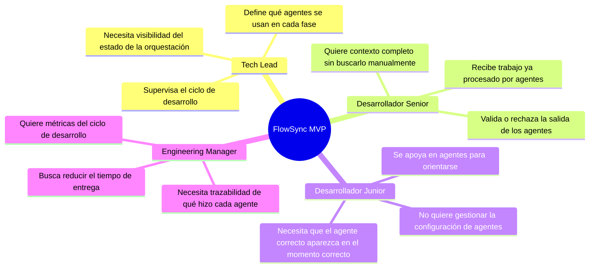
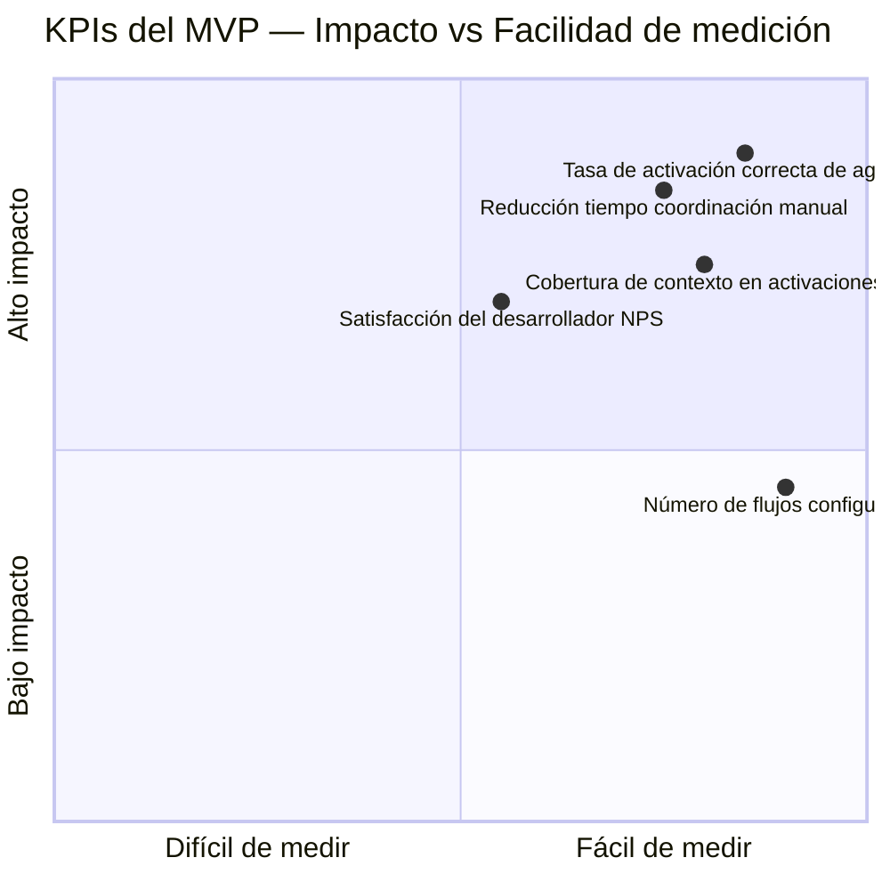
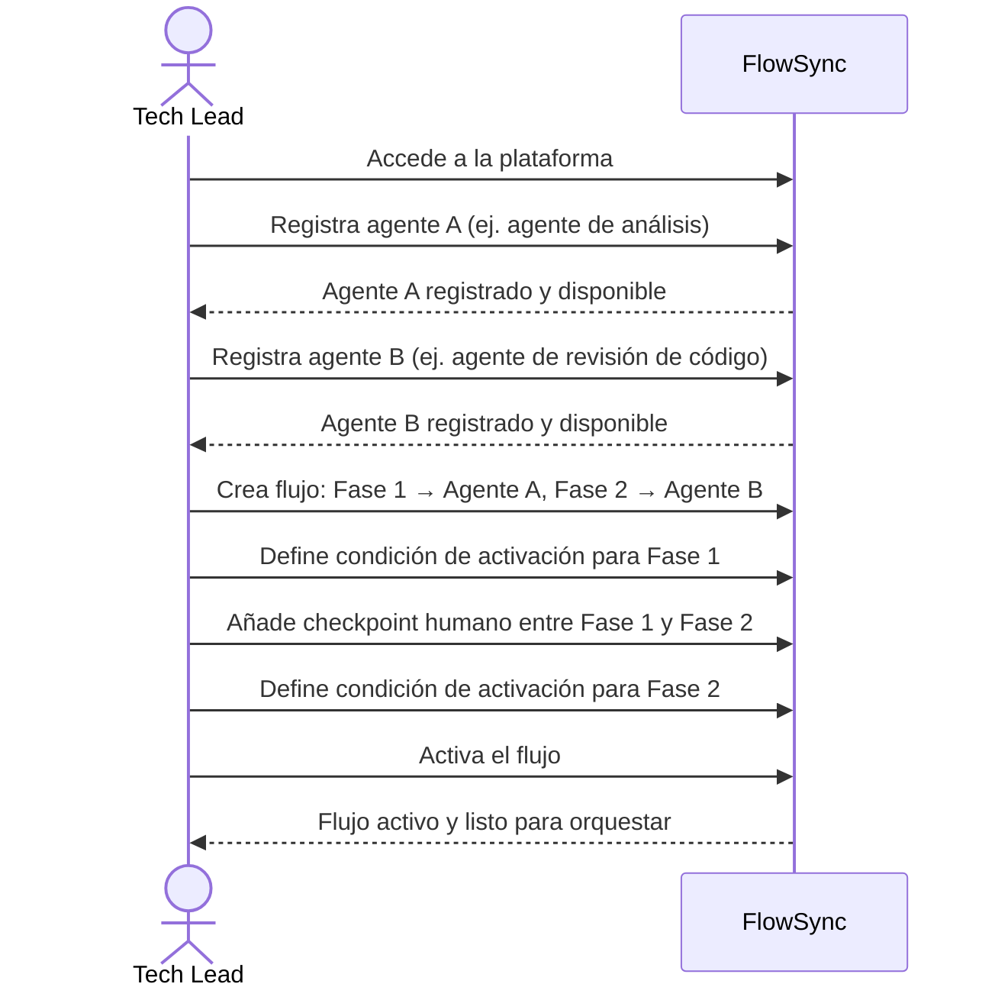
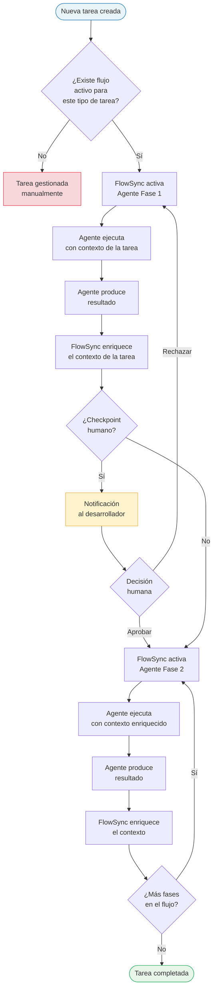
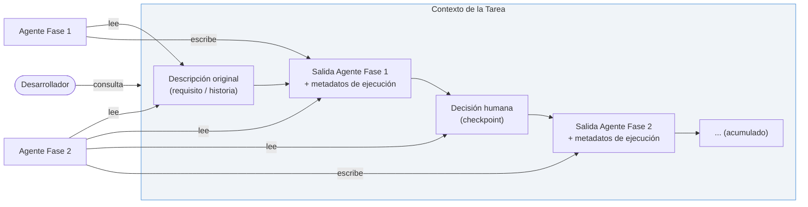
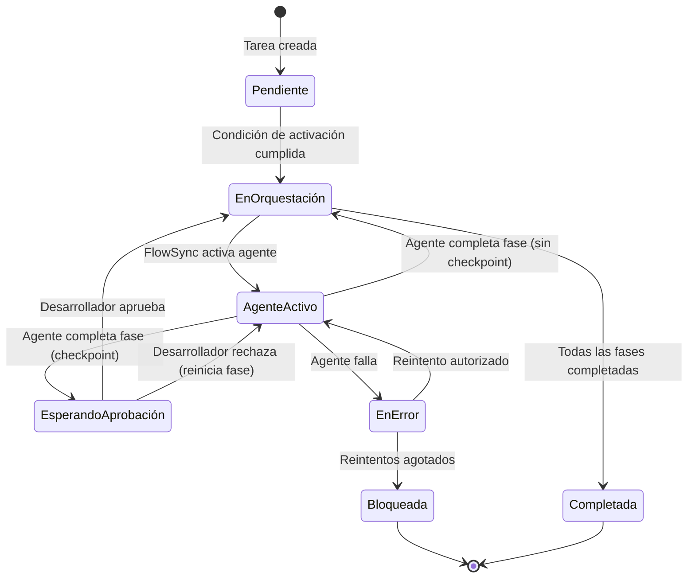

# PRD — FlowSync MVP
**Product Requirements Document**
**Versión:** 1.0 — MVP
**Fecha:** 2026-06-29
**Estado:** Borrador

---

## Tabla de contenidos

1. [Resumen ejecutivo](#1-resumen-ejecutivo)
2. [Problema](#2-problema)
3. [Visión del producto](#3-visión-del-producto)
4. [Usuarios objetivo](#4-usuarios-objetivo)
5. [Alcance del MVP](#5-alcance-del-mvp)
6. [Objetivos y métricas de éxito](#6-objetivos-y-métricas-de-éxito)
7. [Casos de uso](#7-casos-de-uso)
8. [Requisitos funcionales](#8-requisitos-funcionales)
9. [Requisitos no funcionales](#9-requisitos-no-funcionales)
10. [Fuera de alcance (MVP)](#10-fuera-de-alcance-mvp)
11. [Flujos principales](#11-flujos-principales)
12. [Criterios de aceptación](#12-criterios-de-aceptación)
13. [Glosario](#13-glosario)

---

## 1. Resumen ejecutivo

FlowSync es una plataforma de orquestación diseñada para coordinar el trabajo entre personas, agentes de IA y herramientas de desarrollo. Su propósito es garantizar que cada tarea llegue al agente adecuado en el momento oportuno, manteniendo el contexto compartido y eliminando el trabajo en silos.

El **MVP de FlowSync** se centra exclusivamente en la **orquestación de agentes de IA durante el ciclo de vida del desarrollo de software**. Esto significa que la plataforma será capaz de decidir qué agente de IA actúa, cuándo actúa, en qué orden y con qué información, sin requerir intervención manual constante del equipo de desarrollo.

---

## 2. Problema

### 2.1 Contexto

Los equipos de desarrollo modernos adoptan cada vez más agentes de IA especializados para tareas concretas: generación de código, revisión de código, escritura de tests, análisis de seguridad, documentación, etc. Sin embargo, estos agentes funcionan como herramientas independientes, sin coordinación entre sí.

### 2.2 Dolores actuales

| # | Dolor | Impacto |
|---|-------|---------|
| 1 | Los agentes de IA trabajan de forma aislada, sin saber qué ha hecho otro agente antes | Trabajo duplicado, resultados inconsistentes |
| 2 | El equipo debe invocar manualmente cada agente en el momento correcto del ciclo | Fricción, interrupciones y olvidos frecuentes |
| 3 | No existe un punto central que decida qué agente debe actuar en cada fase del desarrollo | Caos en equipos con múltiples agentes activos |
| 4 | El contexto de una tarea (requisitos, decisiones, código, errores) no viaja con el agente | El agente trabaja con información parcial, produciendo resultados de menor calidad |
| 5 | No hay visibilidad sobre el estado de los agentes ni sobre qué han ejecutado | Difícil auditabilidad y trazabilidad |

### 2.3 Consecuencias

- Se pierde el valor potencial de los agentes de IA porque cada uno opera como una herramienta aislada.
- Los desarrolladores invierten tiempo coordinando agentes en lugar de crear producto.
- Los errores en fases tempranas (diseño, requisitos) llegan sin detectar hasta fases tardías porque los agentes no tienen visión del ciclo completo.

---

## 3. Visión del producto

> **"FlowSync convierte a los agentes de IA en un equipo coordinado que acompaña al software desde la idea hasta el despliegue, actuando en el momento justo y compartiendo el contexto que necesitan para hacerlo bien."**

### 3.1 Propuesta de valor del MVP

FlowSync MVP elimina la coordinación manual de agentes de IA durante el ciclo de vida del desarrollo. La plataforma orquesta automáticamente qué agente actúa en cada fase, asegurando que dispone del contexto necesario y que su resultado alimenta a la siguiente fase o agente.

---

## 4. Usuarios objetivo

### 4.1 Perfiles de usuario

### 4.2 Descripción de perfiles

**Tech Lead**
- Responsable de configurar el flujo de orquestación: qué agentes participan, en qué fases y con qué criterios de activación.
- Su satisfacción se mide por la reducción de interrupciones para coordinar agentes manualmente.

**Desarrollador Senior / Junior**
- Consume el trabajo de los agentes y proporciona feedback o aprobación.
- Su satisfacción se mide por la calidad y relevancia de lo que el agente produce en cada momento.

**Engineering Manager**
- No interactúa directamente con los agentes pero sí con los resultados de la orquestación.
- Su satisfacción se mide por la visibilidad del ciclo y la reducción del time-to-merge o time-to-deploy.

---

## 5. Alcance del MVP

### 5.1 Qué incluye el MVP

El MVP cubre exclusivamente la capacidad de **orquestar agentes de IA a lo largo del ciclo de vida del desarrollo de software**. Esto implica:

1. **Registro de agentes**: La plataforma puede conocer y registrar qué agentes de IA están disponibles y cuál es su responsabilidad.
2. **Definición de flujos de orquestación**: El usuario puede definir en qué fase del ciclo de desarrollo actúa cada agente y bajo qué condiciones.
3. **Activación contextual de agentes**: La plataforma activa al agente correcto cuando se cumplen las condiciones definidas para su fase.
4. **Transferencia de contexto entre agentes**: La salida de un agente se convierte en entrada del siguiente, con el contexto acumulado de la tarea.
5. **Visibilidad del estado de la orquestación**: El usuario puede ver en qué estado está cada agente y qué ha producido.

### 5.2 Ciclo de vida del desarrollo cubierto

> FlowSync MVP permite asignar uno o más agentes a cada una de estas fases y orquesta su ejecución secuencial o paralela según la configuración del flujo.

---

## 6. Objetivos y métricas de éxito

### 6.1 Objetivos del MVP

| Objetivo | Descripción |
|----------|-------------|
| O1 | Eliminar la necesidad de invocar agentes manualmente en cada fase del desarrollo |
| O2 | Garantizar que cada agente recibe el contexto completo de la tarea cuando actúa |
| O3 | Proporcionar trazabilidad de qué agente actuó, cuándo y qué produjo |
| O4 | Reducir el tiempo que los desarrolladores dedican a coordinar agentes |

### 6.2 Métricas de éxito (KPIs)

| KPI | Definición | Meta MVP |
|-----|-----------|----------|
| Tasa de activación correcta | % de veces que el agente correcto se activa en la fase correcta | ≥ 90% |
| Cobertura de contexto | % de activaciones en las que el agente recibe el contexto completo de la tarea | ≥ 85% |
| Reducción de invocación manual | % de fases del ciclo de vida donde el desarrollador no tuvo que invocar al agente manualmente | ≥ 80% |
| NPS del desarrollador | Net Promoter Score del equipo que usa FlowSync | ≥ 30 |

---

## 7. Casos de uso

### 7.1 Mapa de casos de uso

```mermaid
flowchart TD
    TL([Tech Lead]) -->|Configura| CU1[Registrar agente en la plataforma]
    TL -->|Configura| CU2[Definir flujo de orquestación]
    TL -->|Consulta| CU6[Ver estado general de la orquestación]

    DEV([Desarrollador]) -->|Consulta| CU3[Ver contexto acumulado de una tarea]
    DEV -->|Interactúa| CU4[Aprobar o rechazar salida de un agente]
    DEV -->|Consulta| CU5[Ver historial de activaciones de agentes]

    PLAT([FlowSync]) -->|Ejecuta automáticamente| CU7[Activar agente según condición de fase]
    PLAT -->|Ejecuta automáticamente| CU8[Transferir contexto entre agentes]
    PLAT -->|Ejecuta automáticamente| CU9[Registrar resultado de cada agente]

    style PLAT fill:#fff3cd,stroke:#f0ad4e
    style TL fill:#d1ecf1,stroke:#17a2b8
    style DEV fill:#d4edda,stroke:#28a745
```

### 7.2 Descripción de casos de uso principales

#### CU1 — Registrar agente en la plataforma

**Actor:** Tech Lead
**Descripción:** El Tech Lead da de alta un nuevo agente de IA en FlowSync, indicando su nombre, descripción funcional y cuál es su responsabilidad dentro del ciclo de desarrollo.
**Precondición:** El agente existe y está disponible para ser invocado.
**Resultado esperado:** El agente queda disponible para ser asignado a uno o varios flujos de orquestación.

---

#### CU2 — Definir flujo de orquestación

**Actor:** Tech Lead
**Descripción:** El Tech Lead crea un flujo de orquestación indicando qué agentes actúan en cada fase del ciclo de vida, en qué orden, y bajo qué condiciones se activa cada uno.
**Precondición:** Los agentes a incluir en el flujo están registrados.
**Resultado esperado:** El flujo queda activo y FlowSync comienza a orquestar las activaciones según lo definido.

---

#### CU7 — Activar agente según condición de fase

**Actor:** FlowSync (sistema)
**Descripción:** Cuando se cumplen las condiciones definidas para una fase (p. ej., se crea una tarea nueva, se aprueba un diseño, se hace un commit), FlowSync activa automáticamente al agente asignado a esa fase.
**Precondición:** Existe un flujo de orquestación activo que incluye esa fase.
**Resultado esperado:** El agente se activa con el contexto completo de la tarea en ese momento.

---

#### CU8 — Transferir contexto entre agentes

**Actor:** FlowSync (sistema)
**Descripción:** Al finalizar la ejecución de un agente, FlowSync recoge su salida, la añade al contexto acumulado de la tarea y lo pasa al siguiente agente del flujo.
**Precondición:** El agente anterior ha completado su ejecución y ha producido una salida.
**Resultado esperado:** El siguiente agente recibe el contexto enriquecido con el trabajo acumulado hasta ese momento.

---

#### CU4 — Aprobar o rechazar salida de un agente

**Actor:** Desarrollador
**Descripción:** En los puntos de control definidos en el flujo, el desarrollador puede revisar la salida de un agente y decidir si el flujo continúa al siguiente agente o si la tarea vuelve a un estado anterior.
**Precondición:** El agente ha completado su fase y el flujo requiere aprobación humana antes de continuar.
**Resultado esperado:** El flujo avanza o retrocede según la decisión del desarrollador.

---

## 8. Requisitos funcionales

### 8.1 Gestión de agentes

| ID | Requisito |
|----|-----------|
| RF-01 | La plataforma debe permitir registrar un agente indicando su nombre y descripción funcional |
| RF-02 | La plataforma debe permitir listar todos los agentes disponibles |
| RF-03 | La plataforma debe permitir activar o desactivar un agente sin eliminarlo del flujo |
| RF-04 | Cada agente debe tener asociada una o varias fases del ciclo de desarrollo a las que puede ser asignado |

### 8.2 Definición de flujos de orquestación

| ID | Requisito |
|----|-----------|
| RF-05 | La plataforma debe permitir crear un flujo de orquestación compuesto por una secuencia de fases |
| RF-06 | Cada fase del flujo debe tener asociado al menos un agente |
| RF-07 | El usuario debe poder definir las condiciones que disparan la activación del agente en cada fase |
| RF-08 | El flujo debe permitir definir puntos de control humanos (checkpoints) entre fases |
| RF-09 | La plataforma debe permitir definir flujos con ejecución secuencial y/o paralela de agentes |
| RF-10 | Un flujo debe poder activarse manualmente o de forma automática según condiciones |

### 8.3 Orquestación y activación

| ID | Requisito |
|----|-----------|
| RF-11 | La plataforma debe activar automáticamente al agente asignado cuando se cumplen las condiciones de su fase |
| RF-12 | La plataforma debe garantizar que el agente recibe el contexto completo y actualizado de la tarea en el momento de su activación |
| RF-13 | La plataforma debe recoger la salida del agente y añadirla al contexto acumulado de la tarea |
| RF-14 | La plataforma debe detener el flujo y notificar cuando se requiere una decisión humana en un checkpoint |
| RF-15 | La plataforma debe permitir reintentar la activación de un agente si este falla |
| RF-16 | La plataforma debe permitir saltar una fase del flujo bajo aprobación explícita del usuario |

### 8.4 Contexto compartido

| ID | Requisito |
|----|-----------|
| RF-17 | Cada tarea debe tener un contexto que se enriquece progresivamente a lo largo del flujo |
| RF-18 | El contexto de una tarea debe incluir como mínimo: descripción original, salidas de agentes anteriores y decisiones humanas tomadas |
| RF-19 | El contexto debe ser consultable por el usuario en cualquier momento del flujo |
| RF-20 | El contexto no debe modificarse retroactivamente; solo puede ser ampliado |

### 8.5 Visibilidad y trazabilidad

| ID | Requisito |
|----|-----------|
| RF-21 | La plataforma debe mostrar el estado actual de cada tarea dentro del flujo |
| RF-22 | La plataforma debe registrar un historial de activaciones: qué agente actuó, cuándo y qué produjo |
| RF-23 | El usuario debe poder ver en qué fase se encuentra cada tarea en tiempo real |
| RF-24 | La plataforma debe notificar al usuario cuando una tarea requiere su atención (checkpoint o error) |

---

## 9. Requisitos no funcionales

| ID | Categoría | Requisito |
|----|-----------|-----------|
| RNF-01 | Fiabilidad | La plataforma debe garantizar que ninguna activación de agente se pierde aunque el sistema falle durante su ejecución |
| RNF-02 | Trazabilidad | Toda activación de agente debe quedar registrada con suficiente información para ser auditada |
| RNF-03 | Usabilidad | Un Tech Lead debe ser capaz de configurar un flujo de orquestación completo sin formación técnica específica |
| RNF-04 | Escalabilidad | La plataforma debe poder gestionar múltiples flujos activos simultáneamente sin degradación de la orquestación |
| RNF-05 | Disponibilidad | La orquestación no debe detenerse por la ausencia temporal de un agente; debe reintentar o notificar |
| RNF-06 | Privacidad | El contexto de una tarea solo debe ser accesible para los usuarios y agentes autorizados dentro del flujo |

---

## 10. Fuera de alcance (MVP)

Los siguientes puntos forman parte de la visión de producto completa de FlowSync pero **quedan fuera del alcance del MVP**:

| Fuera de alcance | Descripción |
|-----------------|-------------|
| Sincronización con herramientas externas | Integración con GitHub, Jira, CI/CD, IDEs u otras herramientas |
| Coordinación de personas | Gestión de tareas asignadas a humanos (no agentes) |
| Handoffs humano-agente | Transición formal de trabajo desde un humano a un agente y viceversa más allá de los checkpoints básicos |
| Monitorización de despliegues | Seguimiento del estado de builds, pipelines de CI/CD o despliegues en producción |
| Gestión de permisos avanzada | Control de acceso granular a nivel de flujo o agente |
| Marketplace de agentes | Catálogo de agentes de terceros disponibles para incorporar al flujo |

---

## 11. Flujos principales

### 11.1 Flujo de configuración de orquestación (Tech Lead)

### 11.2 Flujo de orquestación automática (ciclo de vida de una tarea)

### 11.3 Estructura del contexto compartido de una tarea

### 11.4 Estados de una tarea en el flujo

---

## 12. Criterios de aceptación

Los siguientes criterios definen cuándo el MVP puede considerarse funcional y listo para validación con usuarios reales:

| # | Criterio |
|---|---------|
| CA-01 | Un Tech Lead puede registrar al menos un agente en la plataforma sin asistencia |
| CA-02 | Un Tech Lead puede crear un flujo de orquestación con al menos dos fases y dos agentes distintos |
| CA-03 | Cuando se crea una tarea, FlowSync activa automáticamente al agente de la primera fase sin intervención manual |
| CA-04 | El segundo agente del flujo recibe en su contexto la salida del primer agente |
| CA-05 | Un desarrollador puede ver el contexto acumulado de una tarea en cualquier momento |
| CA-06 | Si existe un checkpoint, el flujo se detiene y el desarrollador recibe una notificación |
| CA-07 | Si el desarrollador rechaza la salida en un checkpoint, el agente de esa fase vuelve a ejecutarse |
| CA-08 | El historial de activaciones de una tarea es visible y contiene: agente, timestamp y resultado |
| CA-09 | Si un agente falla, la plataforma notifica al usuario y permite reintentar |
| CA-10 | El flujo de orquestación puede ser desactivado sin perder su configuración |

---

## 13. Glosario

| Término | Definición |
|---------|-----------|
| **Agente de IA** | Componente autónomo que ejecuta una tarea específica dentro del ciclo de desarrollo (análisis, revisión, testing, etc.) |
| **Flujo de orquestación** | Secuencia configurada de fases y agentes que define cómo se debe procesar una tarea a lo largo del ciclo de desarrollo |
| **Fase** | Etapa del ciclo de vida del desarrollo (análisis, diseño, implementación, revisión, testing, documentación) a la que se asigna uno o más agentes |
| **Contexto** | Conjunto acumulado de información asociada a una tarea: descripción original, salidas de agentes y decisiones humanas |
| **Checkpoint** | Punto de control dentro del flujo donde se requiere una decisión humana antes de que la orquestación continúe |
| **Activación** | Acción por la que FlowSync invoca a un agente, entregándole el contexto de la tarea |
| **Handoff** | Transferencia de trabajo y contexto de un agente al siguiente dentro del flujo |
| **Orquestador** | FlowSync en su rol de sistema que decide qué agente actúa, cuándo y con qué información |

---

*Documento elaborado en el marco del curso AI4Devs — Sesión 04*
*FlowSync MVP v1.0 — Sujeto a revisión y validación con usuarios*
