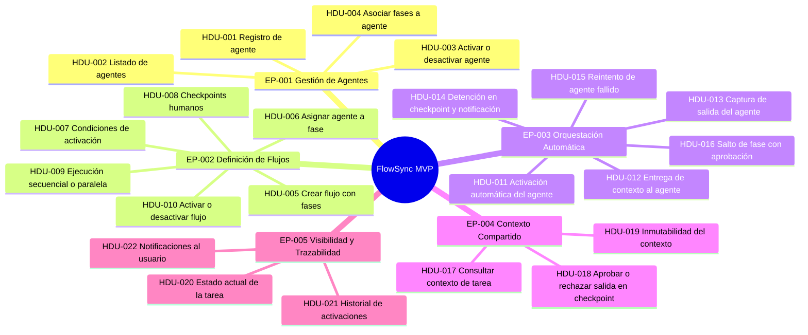

# FlowSync MVP — Historias de Usuario
**Versión:** 1.1
**Fecha:** 2026-06-29
**Producto:** FlowSync MVP
**Referencia:** [PRD.md](PRD.md)

---

## Tabla de contenidos

- [EP-001 — Gestión de Agentes de IA](#ep-001--gestión-de-agentes-de-ia)
- [EP-002 — Definición de Flujos de Orquestación](#ep-002--definición-de-flujos-de-orquestación)
- [EP-003 — Orquestación y Activación Automática de Agentes](#ep-003--orquestación-y-activación-automática-de-agentes)
- [EP-004 — Gestión del Contexto Compartido](#ep-004--gestión-del-contexto-compartido)
- [EP-005 — Visibilidad y Trazabilidad de la Orquestación](#ep-005--visibilidad-y-trazabilidad-de-la-orquestación)

---

## EP-001 — Gestión de Agentes de IA

> Agrupa todas las funcionalidades que permiten al Tech Lead registrar, listar y administrar los agentes de IA disponibles en la plataforma, como paso previo e indispensable para poder construir flujos de orquestación.
>
> **Requisitos relacionados:** RF-01, RF-02, RF-03, RF-04

---

### HDU-001 — Registro de un nuevo agente de IA en la plataforma

**Historia de usuario:**
Como Tech Lead, quiero registrar un nuevo agente de IA en la plataforma indicando su nombre, descripción funcional y las fases del ciclo de desarrollo en las que puede participar, para que esté disponible al construir flujos de orquestación.

**Descripción:**
El Tech Lead necesita dar de alta agentes de IA antes de poder asignarlos a un flujo. El registro debe requerir información suficiente para identificar al agente y comprender su propósito dentro del ciclo de desarrollo, sin requerir conocimiento técnico sobre cómo está implementado internamente.

**Criterios de Aceptación:**

- Dado que el Tech Lead accede a la sección de agentes de la plataforma, cuando completa el nombre y la descripción funcional del agente y confirma el registro, entonces el agente aparece en el listado de agentes disponibles con los datos introducidos.
- Dado que el Tech Lead intenta registrar un agente, cuando no introduce el nombre del agente, entonces la plataforma impide el guardado y muestra un mensaje indicando que el nombre es obligatorio.
- Dado que el Tech Lead completa el registro de un agente, cuando el proceso finaliza correctamente, entonces la plataforma confirma visualmente que el agente ha sido registrado y está disponible para ser asignado a flujos.

**Notas adicionales:**
- El registro no requiere que el Tech Lead conozca detalles de implementación del agente.
- En el MVP no se contempla un marketplace ni agentes de terceros; los agentes se registran manualmente.

**Historias de usuario relacionadas:** HDU-002, HDU-004, HDU-006

**Definition of Done:**
- [ ] Formulario de registro de agente implementado con campos: nombre (obligatorio), descripción funcional y fases asociadas
- [ ] Validación de campos obligatorios implementada con mensajes de error claros
- [ ] El agente registrado aparece inmediatamente en el listado de agentes (HDU-002)
- [ ] Tests funcionales cubriendo los tres escenarios GWT definidos en los criterios de aceptación
- [ ] Persistencia verificada: el agente sigue disponible tras recargar la plataforma
- [ ] Revisión completada y aprobada

---

### HDU-002 — Consulta del listado de agentes disponibles

**Historia de usuario:**
Como Tech Lead, quiero consultar el listado completo de los agentes registrados en la plataforma, para conocer qué agentes están disponibles antes de diseñar o modificar un flujo de orquestación.

**Descripción:**
El Tech Lead necesita una vista general de todos los agentes existentes, con información suficiente para distinguirlos y conocer su estado actual (activo o inactivo), sin necesidad de acceder a cada agente individualmente.

**Criterios de Aceptación:**

- Dado que el Tech Lead accede a la sección de agentes, cuando la plataforma carga la vista, entonces se muestra un listado con todos los agentes registrados, incluyendo su nombre, descripción funcional y estado (activo/inactivo).
- Dado que no existe ningún agente registrado aún, cuando el Tech Lead accede al listado, entonces la plataforma muestra un mensaje indicando que no hay agentes disponibles y sugiere registrar el primero.
- Dado que existen varios agentes registrados, cuando el Tech Lead consulta el listado, entonces puede distinguir visualmente cuáles están activos y cuáles están inactivos.

**Notas adicionales:**
- El listado debe ser accesible también para desarrolladores que quieran conocer qué agentes están disponibles.

**Historias de usuario relacionadas:** HDU-001, HDU-003

**Definition of Done:**
- [ ] Vista de listado implementada mostrando nombre, descripción y estado de cada agente
- [ ] Estado activo/inactivo diferenciado visualmente (por ejemplo, mediante etiqueta o color)
- [ ] Estado vacío implementado con mensaje orientativo cuando no existen agentes
- [ ] Tests funcionales cubriendo los tres escenarios GWT definidos en los criterios de aceptación
- [ ] Vista accesible tanto para Tech Lead como para desarrolladores
- [ ] Revisión completada y aprobada

---

### HDU-003 — Activación y desactivación de un agente

**Historia de usuario:**
Como Tech Lead, quiero poder activar o desactivar un agente registrado sin eliminarlo de la plataforma, para poder gestionar su disponibilidad sin perder su configuración ni afectar a su historial de ejecuciones.

**Descripción:**
En ocasiones es necesario deshabilitar temporalmente un agente (por mantenimiento, revisión o sustitución) sin eliminarlo del sistema. La desactivación debe impedir que el agente sea invocado en nuevas activaciones, pero no debe afectar a los flujos ya completados ni a los registros históricos.

**Criterios de Aceptación:**

- Dado que un agente está activo, cuando el Tech Lead selecciona la opción de desactivarlo, entonces el agente pasa al estado inactivo y no puede ser asignado a nuevas fases ni activado en flujos en ejecución.
- Dado que un agente está inactivo, cuando el Tech Lead selecciona la opción de activarlo, entonces el agente vuelve al estado activo y queda disponible para ser asignado a flujos.
- Dado que el Tech Lead desactiva un agente que forma parte de un flujo activo, entonces la plataforma informa al Tech Lead de que ese agente participa en flujos activos y solicita confirmación antes de proceder.

**Notas adicionales:**
- La desactivación no elimina el historial de activaciones pasadas del agente.

**Historias de usuario relacionadas:** HDU-001, HDU-002, HDU-006

**Definition of Done:**
- [ ] Acción de activar/desactivar disponible en el listado y en el detalle del agente
- [ ] Diálogo de confirmación implementado cuando el agente pertenece a un flujo activo
- [ ] El agente inactivo no aparece como opción válida para asignar en nuevos flujos (HDU-006)
- [ ] El historial de activaciones del agente se mantiene inalterado tras la desactivación
- [ ] Tests funcionales cubriendo los tres escenarios GWT definidos en los criterios de aceptación
- [ ] Revisión completada y aprobada

---

### HDU-004 — Asociación de fases del ciclo de desarrollo a un agente

**Historia de usuario:**
Como Tech Lead, quiero asociar uno o más fases del ciclo de desarrollo a un agente registrado, para que al diseñar un flujo solo pueda asignarse ese agente a las fases que le corresponden según su propósito.

**Descripción:**
Cada agente tiene un ámbito funcional definido (análisis, revisión, testing, documentación, etc.). Asociar las fases en el momento del registro evita errores de configuración al construir flujos, como asignar un agente de testing a la fase de análisis.

**Criterios de Aceptación:**

- Dado que el Tech Lead registra o edita un agente, cuando selecciona una o varias fases del ciclo de desarrollo (análisis, diseño, implementación, revisión, testing, documentación), entonces el agente queda asociado a esas fases y solo puede ser asignado a ellas en los flujos.
- Dado que el Tech Lead intenta asignar un agente a una fase en un flujo, cuando esa fase no está entre las fases asociadas al agente, entonces la plataforma impide la asignación y muestra un mensaje explicativo.
- Dado que un agente ya tiene fases asociadas, cuando el Tech Lead edita esas asociaciones, entonces los flujos que usaban ese agente en una fase eliminada reciben una advertencia de configuración incompleta.

**Notas adicionales:**
- Las fases disponibles son las definidas en el ciclo de vida del MVP: análisis, diseño, implementación, revisión, testing y documentación.

**Historias de usuario relacionadas:** HDU-001, HDU-006

**Definition of Done:**
- [ ] Selector de fases disponible en el formulario de registro y edición del agente
- [ ] Las seis fases del ciclo de vida del MVP están disponibles como opciones de selección
- [ ] El asignador de agentes en el flujo filtra por compatibilidad de fases al momento de la selección
- [ ] Advertencia de configuración incompleta visible en el flujo afectado cuando se elimina una fase de un agente en uso
- [ ] Tests funcionales cubriendo los tres escenarios GWT definidos en los criterios de aceptación
- [ ] Revisión completada y aprobada

---

## EP-002 — Definición de Flujos de Orquestación

> Agrupa todas las funcionalidades que permiten al Tech Lead diseñar, configurar y gestionar flujos de orquestación: definir las fases, los agentes de cada fase, las condiciones de activación, los checkpoints y el modo de ejecución.
>
> **Requisitos relacionados:** RF-05, RF-06, RF-07, RF-08, RF-09, RF-10

---

### HDU-005 — Creación de un flujo de orquestación con fases

**Historia de usuario:**
Como Tech Lead, quiero crear un flujo de orquestación definiendo una secuencia de fases del ciclo de desarrollo, para establecer el orden en que los agentes de IA deben actuar sobre las tareas del equipo.

**Descripción:**
El flujo de orquestación es la pieza central de FlowSync. El Tech Lead debe poder crear un flujo, asignarle un nombre descriptivo y componer la secuencia de fases que lo forman. La creación del flujo es un paso previo al que se le irán añadiendo agentes, condiciones y checkpoints en pasos posteriores.

**Criterios de Aceptación:**

- Dado que el Tech Lead accede a la sección de flujos, cuando crea un nuevo flujo introduciendo un nombre y añadiendo al menos una fase, entonces el flujo queda guardado en estado borrador y aparece en el listado de flujos.
- Dado que el Tech Lead intenta guardar un flujo sin haberle asignado nombre, cuando confirma el guardado, entonces la plataforma impide la acción y muestra un mensaje indicando que el nombre es obligatorio.
- Dado que el Tech Lead crea un flujo con más de una fase, cuando guarda el flujo, entonces el orden de las fases queda registrado tal como fue definido y puede ser modificado antes de activar el flujo.

**Notas adicionales:**
- Un flujo en estado borrador no orquesta tareas hasta que sea activado explícitamente (ver HDU-010).
- El Tech Lead puede reordenar las fases mientras el flujo esté en estado borrador.

**Historias de usuario relacionadas:** HDU-006, HDU-007, HDU-008, HDU-009, HDU-010

**Definition of Done:**
- [ ] Formulario de creación de flujo implementado con campo de nombre (obligatorio) y editor de secuencia de fases
- [ ] Reordenación de fases disponible en modo borrador
- [ ] El flujo creado aparece en el listado con estado "Borrador" y no ejecuta orquestación hasta ser activado
- [ ] Validación del nombre obligatorio implementada con mensaje de error
- [ ] Tests funcionales cubriendo los tres escenarios GWT definidos en los criterios de aceptación
- [ ] Persistencia del orden de fases verificada
- [ ] Revisión completada y aprobada

---

### HDU-006 — Asignación de un agente a una fase del flujo

**Historia de usuario:**
Como Tech Lead, quiero asignar al menos un agente a cada fase de un flujo de orquestación, para determinar qué agente de IA es responsable de ejecutar el trabajo en esa etapa del ciclo de desarrollo.

**Descripción:**
Una vez creado el flujo con sus fases, el Tech Lead debe poder seleccionar qué agente actúa en cada una de ellas. La plataforma debe mostrar únicamente los agentes compatibles con cada fase según las asociaciones definidas en el registro del agente.

**Criterios de Aceptación:**

- Dado que el Tech Lead edita un flujo en estado borrador, cuando selecciona una fase y elige un agente del listado de agentes compatibles para esa fase, entonces el agente queda asignado a esa fase del flujo.
- Dado que el Tech Lead intenta activar un flujo, cuando alguna de sus fases no tiene un agente asignado, entonces la plataforma impide la activación y señala las fases que están incompletas.
- Dado que el Tech Lead intenta asignar un agente inactivo a una fase, entonces la plataforma impide la asignación e indica que el agente debe estar activo para poder ser usado en un flujo.

**Notas adicionales:**
- En el MVP, el listado de agentes mostrado para asignar a una fase ya está filtrado por compatibilidad de fases (ver HDU-004).

**Historias de usuario relacionadas:** HDU-004, HDU-005, HDU-007

**Definition of Done:**
- [ ] Selector de agente disponible en cada fase del flujo, filtrado por compatibilidad de fases
- [ ] Agentes inactivos excluidos del selector y no asignables
- [ ] Indicador visual de fase incompleta (sin agente asignado) en el diseño del flujo
- [ ] Activación del flujo bloqueada mientras existan fases sin agente asignado, con señalización de las fases afectadas
- [ ] Tests funcionales cubriendo los tres escenarios GWT definidos en los criterios de aceptación
- [ ] Revisión completada y aprobada

---

### HDU-007 — Configuración de condiciones de activación de una fase

**Historia de usuario:**
Como Tech Lead, quiero definir las condiciones bajo las cuales se activa el agente de cada fase del flujo, para que FlowSync pueda decidir automáticamente cuándo invocar a cada agente sin intervención manual.

**Descripción:**
Las condiciones de activación son la clave de la orquestación automática. El Tech Lead debe poder especificar qué evento o estado desencadena la ejecución del agente en cada fase (por ejemplo: creación de una nueva tarea, aprobación de la fase anterior, o inicio manual). Sin esta configuración, el flujo no puede orquestar automáticamente.

**Criterios de Aceptación:**

- Dado que el Tech Lead edita una fase de un flujo, cuando define una condición de activación (entre las opciones disponibles de la plataforma), entonces esa condición queda asociada a la fase y FlowSync la evaluará antes de invocar al agente.
- Dado que el Tech Lead no define ninguna condición de activación para una fase, cuando intenta activar el flujo, entonces la plataforma impide la activación e indica qué fases carecen de condición.
- Dado que el Tech Lead define una condición de activación basada en la finalización de la fase anterior, cuando el agente de la fase previa completa su ejecución, entonces FlowSync activa automáticamente el agente de la siguiente fase.

**Notas adicionales:**
- Las condiciones disponibles en el MVP son las predefinidas por la plataforma; la creación de condiciones personalizadas avanzadas queda fuera del alcance del MVP.

**Historias de usuario relacionadas:** HDU-005, HDU-006, HDU-011

**Definition of Done:**
- [ ] Selector de condición de activación disponible en el editor de cada fase del flujo
- [ ] Catálogo de condiciones predefinidas del MVP implementado y seleccionable
- [ ] Activación del flujo bloqueada mientras existan fases sin condición configurada, con señalización de las fases afectadas
- [ ] La condición "finalización de fase anterior" dispara la activación automática del agente siguiente verificado end-to-end
- [ ] Tests funcionales cubriendo los tres escenarios GWT definidos en los criterios de aceptación
- [ ] Revisión completada y aprobada

---

### HDU-008 — Configuración de checkpoints humanos entre fases

**Historia de usuario:**
Como Tech Lead, quiero poder definir puntos de control humanos entre fases del flujo, para que la orquestación se detenga en esos puntos y un desarrollador pueda revisar y aprobar la salida del agente antes de que el flujo continúe.

**Descripción:**
No todas las transiciones entre fases deben ser automáticas. En determinados puntos críticos del ciclo de desarrollo, un humano debe validar lo que el agente ha producido antes de pasar a la siguiente fase. El checkpoint es el mecanismo que garantiza este control sin romper el flujo de orquestación.

**Criterios de Aceptación:**

- Dado que el Tech Lead edita un flujo, cuando activa un checkpoint entre dos fases específicas, entonces esa transición queda marcada como controlada y FlowSync detendrá el flujo en ese punto a la espera de aprobación.
- Dado que el Tech Lead guarda un flujo con checkpoints configurados, cuando consulta el diseño del flujo, entonces los checkpoints aparecen claramente diferenciados de las transiciones automáticas.
- Dado que el Tech Lead elimina un checkpoint de una transición, cuando el flujo está activo y llega a esa transición, entonces el flujo la recorre de forma automática sin esperar intervención humana.

**Notas adicionales:**
- El comportamiento del sistema en un checkpoint (notificación, aprobación o rechazo) se especifica en HDU-014 y HDU-018.

**Historias de usuario relacionadas:** HDU-005, HDU-014, HDU-018

**Definition of Done:**
- [ ] Opción de activar/desactivar checkpoint disponible en cada transición entre fases del editor de flujo
- [ ] Checkpoints diferenciados visualmente de las transiciones automáticas en el diseño del flujo
- [ ] Eliminación de un checkpoint verificada: la transición pasa a ser automática en ejecuciones posteriores
- [ ] Integración con HDU-014 verificada: el flujo se detiene y notifica al llegar al checkpoint en ejecución real
- [ ] Tests funcionales cubriendo los tres escenarios GWT definidos en los criterios de aceptación
- [ ] Revisión completada y aprobada

---

### HDU-009 — Configuración de ejecución secuencial o paralela de agentes en una fase

**Historia de usuario:**
Como Tech Lead, quiero poder configurar si los agentes de una misma fase se ejecutan de forma secuencial o en paralelo, para optimizar el tiempo de ejecución de las fases que admiten trabajo simultáneo entre agentes.

**Descripción:**
Algunas fases pueden requerir la actuación de más de un agente. En ciertos casos el orden entre ellos importa (secuencial); en otros, pueden trabajar al mismo tiempo sobre la misma tarea sin dependencias entre sí (paralelo). El Tech Lead debe poder elegir este comportamiento por fase.

**Criterios de Aceptación:**

- Dado que el Tech Lead asigna más de un agente a una misma fase, cuando configura el modo de ejecución como secuencial, entonces FlowSync activa los agentes uno a uno en el orden definido, pasando el contexto de uno al siguiente.
- Dado que el Tech Lead asigna más de un agente a una misma fase, cuando configura el modo de ejecución como paralelo, entonces FlowSync activa todos los agentes simultáneamente con el mismo contexto de entrada y recoge todas sus salidas antes de avanzar a la siguiente fase.
- Dado que solo hay un agente asignado a una fase, cuando el Tech Lead intenta configurar el modo de ejecución, entonces la plataforma indica que la configuración de paralelismo no aplica con un único agente.

**Notas adicionales:**
- Cuando la ejecución es paralela, el contexto que se pasa a la siguiente fase incluye las salidas de todos los agentes de la fase paralela.

**Historias de usuario relacionadas:** HDU-006, HDU-011, HDU-013

**Definition of Done:**
- [ ] Selector de modo de ejecución (secuencial/paralelo) disponible en fases con más de un agente asignado
- [ ] Selector deshabilitado o ausente cuando la fase tiene un único agente, con mensaje informativo
- [ ] Modo secuencial verificado end-to-end: los agentes se activan en orden y el contexto fluye entre ellos
- [ ] Modo paralelo verificado end-to-end: los agentes se activan simultáneamente y sus salidas se agregan al contexto antes de avanzar
- [ ] Tests funcionales cubriendo los tres escenarios GWT definidos en los criterios de aceptación
- [ ] Revisión completada y aprobada

---

### HDU-010 — Activación y desactivación de un flujo de orquestación

**Historia de usuario:**
Como Tech Lead, quiero poder activar o desactivar un flujo de orquestación, para controlar cuándo FlowSync comienza o detiene la orquestación automática de agentes para ese flujo, sin perder su configuración.

**Descripción:**
Un flujo puede encontrarse en diferentes estados a lo largo de su ciclo de vida: en diseño (borrador), activo u orquestando tareas, o temporalmente desactivado. El Tech Lead debe tener control explícito sobre cuándo un flujo está operativo.

**Criterios de Aceptación:**

- Dado que un flujo está completo y correctamente configurado (todas las fases tienen agente y condición de activación), cuando el Tech Lead lo activa, entonces el flujo pasa a estado activo y FlowSync comienza a evaluarlo para orquestar nuevas tareas.
- Dado que un flujo está activo, cuando el Tech Lead lo desactiva, entonces el flujo deja de evaluar nuevas condiciones de activación; las tareas en curso en ese flujo se mantienen en su estado hasta que el Tech Lead decida qué hacer con ellas.
- Dado que el Tech Lead desactiva un flujo, cuando consulta el listado de flujos, entonces el flujo aparece con estado inactivo y su configuración permanece intacta para poder ser reactivado o modificado.

**Notas adicionales:**
- La desactivación de un flujo no elimina su historial de ejecuciones pasadas.

**Historias de usuario relacionadas:** HDU-005, HDU-021

**Definition of Done:**
- [ ] Acción de activar/desactivar flujo disponible en el listado y en el detalle del flujo
- [ ] Activación bloqueada si el flujo no está completamente configurado (fases sin agente o sin condición), con indicación del motivo
- [ ] Tareas en curso no interrumpidas al desactivar el flujo: mantienen su estado actual
- [ ] Historial de ejecuciones del flujo preservado tras la desactivación
- [ ] Estado del flujo (activo/inactivo) visible en el listado de flujos
- [ ] Tests funcionales cubriendo los tres escenarios GWT definidos en los criterios de aceptación
- [ ] Revisión completada y aprobada

---

## EP-003 — Orquestación y Activación Automática de Agentes

> Agrupa todas las funcionalidades que ejecuta FlowSync de forma automática durante la vida de una tarea: activar al agente correcto en el momento oportuno, entregarle el contexto, gestionar checkpoints, reintentos y saltos de fase.
>
> **Requisitos relacionados:** RF-11, RF-12, RF-13, RF-14, RF-15, RF-16

---

### HDU-011 — Activación automática del agente al cumplirse la condición de una fase

**Historia de usuario:**
Como desarrollador, quiero que FlowSync active automáticamente al agente correspondiente cuando se cumple la condición definida para su fase, para no tener que recordar ni ejecutar manualmente la invocación del agente en cada etapa del ciclo de desarrollo.

**Descripción:**
Este es el comportamiento central de FlowSync: cuando el sistema detecta que se ha cumplido la condición de activación de una fase (por ejemplo, que se ha creado una nueva tarea, que la fase anterior ha finalizado o que un desarrollador ha aprobado un checkpoint), FlowSync invoca automáticamente al agente asignado a esa fase.

**Criterios de Aceptación:**

- Dado que existe un flujo activo con una condición de activación configurada para su primera fase, cuando se crea una nueva tarea, entonces FlowSync activa automáticamente al agente de esa fase sin que el desarrollador tenga que invocarlo.
- Dado que un agente completa su fase y la siguiente fase tiene una condición de activación basada en la finalización de la anterior, cuando el agente termina y no hay checkpoint, entonces FlowSync activa automáticamente al agente de la siguiente fase.
- Dado que el flujo detecta que la condición de una fase se ha cumplido pero el agente asignado está inactivo, cuando evalúa la activación, entonces FlowSync no activa el agente, marca la tarea como bloqueada y notifica al Tech Lead.

**Notas adicionales:**
- La activación automática solo ocurre cuando el flujo está en estado activo.

**Historias de usuario relacionadas:** HDU-007, HDU-012, HDU-014, HDU-020

**Definition of Done:**
- [ ] Motor de evaluación de condiciones de activación implementado y ejecutándose en background
- [ ] Activación automática del primer agente verificada end-to-end al crearse una nueva tarea con flujo activo
- [ ] Encadenamiento automático entre fases verificado cuando no hay checkpoint
- [ ] Caso de agente inactivo gestionado: tarea bloqueada y notificación al Tech Lead enviada
- [ ] La activación no ocurre si el flujo está en estado inactivo (verificado)
- [ ] Tests funcionales cubriendo los tres escenarios GWT definidos en los criterios de aceptación
- [ ] Revisión completada y aprobada

---

### HDU-012 — Entrega del contexto completo al agente en el momento de su activación

**Historia de usuario:**
Como desarrollador, quiero que cuando FlowSync activa un agente, le entregue automáticamente el contexto completo y actualizado de la tarea hasta ese momento, para que el agente disponga de toda la información relevante y produzca resultados de mayor calidad sin depender de que yo se la proporcione manualmente.

**Descripción:**
Uno de los principales dolores identificados en el PRD es que los agentes trabajan con información parcial. FlowSync debe garantizar que cada vez que activa un agente, este recibe el contexto acumulado: la descripción original de la tarea, las salidas de agentes anteriores y las decisiones humanas tomadas en checkpoints.

**Criterios de Aceptación:**

- Dado que FlowSync activa el primer agente de un flujo, cuando el agente recibe la invocación, entonces el contexto que recibe incluye al menos la descripción original de la tarea.
- Dado que FlowSync activa un agente que no es el primero del flujo, cuando el agente recibe la invocación, entonces el contexto incluye la descripción original, las salidas de todos los agentes que actuaron previamente y las decisiones tomadas en los checkpoints anteriores.
- Dado que FlowSync va a activar un agente, cuando el contexto de la tarea no puede construirse de forma completa por un fallo del sistema, entonces FlowSync no activa el agente, registra el error y notifica al usuario.

**Notas adicionales:**
- El contexto que recibe el agente es de solo lectura; el agente no puede modificar el historial de contexto acumulado, solo añadir su salida.

**Historias de usuario relacionadas:** HDU-011, HDU-013, HDU-017

**Definition of Done:**
- [ ] Constructor de contexto implementado: agrega descripción original + salidas previas + decisiones de checkpoints
- [ ] Primer agente del flujo recibe al menos la descripción original de la tarea (verificado)
- [ ] Agentes posteriores reciben el contexto acumulado completo hasta ese momento (verificado)
- [ ] Fallo en la construcción del contexto gestionado: agente no activado, error registrado y usuario notificado
- [ ] El contexto entregado al agente es inmutable desde la perspectiva del agente receptor
- [ ] Tests funcionales cubriendo los tres escenarios GWT definidos en los criterios de aceptación
- [ ] Revisión completada y aprobada

---

### HDU-013 — Captura de la salida del agente y enriquecimiento del contexto de la tarea

**Historia de usuario:**
Como desarrollador, quiero que FlowSync capture automáticamente la salida producida por un agente al finalizar su ejecución y la añada al contexto de la tarea, para que los agentes siguientes dispongan de ese resultado sin necesidad de que yo lo traslade manualmente.

**Descripción:**
Cuando un agente termina su ejecución, su resultado debe quedar registrado en el contexto de la tarea de forma automática. Este resultado enriquecido es lo que permite a los agentes posteriores trabajar con información actualizada y construir sobre el trabajo ya realizado.

**Criterios de Aceptación:**

- Dado que un agente ha finalizado su ejecución produciendo una salida, cuando FlowSync recoge esa salida, entonces la añade al contexto de la tarea junto con los metadatos de la ejecución (agente que la produjo, fase y momento).
- Dado que FlowSync ha capturado la salida del agente, cuando el siguiente agente del flujo es activado, entonces recibe el contexto ya enriquecido con esa salida.
- Dado que un agente finaliza su ejecución sin producir una salida (resultado vacío), entonces FlowSync registra en el contexto que el agente ejecutó sin producir resultado y continúa el flujo según las reglas configuradas.

**Notas adicionales:**
- El contexto es inmutable: la salida de un agente se añade, no reemplaza ni modifica salidas anteriores.

**Historias de usuario relacionadas:** HDU-011, HDU-012, HDU-017

**Definition of Done:**
- [ ] Captura automática de la salida del agente implementada al finalizar la ejecución
- [ ] Metadatos de ejecución registrados junto con la salida: nombre del agente, fase y timestamp
- [ ] El siguiente agente del flujo recibe el contexto ya enriquecido (verificado end-to-end)
- [ ] Caso de salida vacía gestionado: registrado en el contexto sin interrumpir el flujo
- [ ] La salida capturada no reemplaza ni modifica entradas previas del contexto (inmutabilidad verificada)
- [ ] Tests funcionales cubriendo los tres escenarios GWT definidos en los criterios de aceptación
- [ ] Revisión completada y aprobada

---

### HDU-014 — Detención del flujo y notificación al llegar a un checkpoint humano

**Historia de usuario:**
Como desarrollador, quiero recibir una notificación cuando la orquestación llega a un checkpoint humano y el flujo queda en espera de mi decisión, para poder revisar la salida del agente en el momento adecuado y decidir si el trabajo continúa.

**Descripción:**
Cuando el flujo alcanza un punto de control configurado como checkpoint humano, FlowSync debe detener la orquestación y avisar a los desarrolladores que deben revisar. El flujo permanece en espera hasta que se toma una decisión (ver HDU-018). La notificación debe proporcionar suficiente contexto para que el desarrollador pueda actuar sin necesitar buscar información adicional.

**Criterios de Aceptación:**

- Dado que un agente completa su fase y la transición hacia la siguiente fase tiene un checkpoint configurado, cuando el agente finaliza, entonces FlowSync detiene el flujo, marca la tarea con el estado "Esperando aprobación" y envía una notificación al desarrollador.
- Dado que la tarea está en estado "Esperando aprobación", cuando el desarrollador recibe la notificación, entonces la notificación incluye el nombre de la tarea, la fase completada, el agente que actuó y un acceso directo a la salida del agente para revisarla.
- Dado que la tarea lleva en estado "Esperando aprobación" sin que nadie la atienda, cuando transcurre un tiempo configurable, entonces la plataforma envía un recordatorio al desarrollador.

**Notas adicionales:**
- La acción de aprobar o rechazar la salida del agente en el checkpoint se especifica en HDU-018.

**Historias de usuario relacionadas:** HDU-008, HDU-018, HDU-020, HDU-022

**Definition of Done:**
- [ ] Detención automática del flujo al alcanzar un checkpoint implementada
- [ ] Estado "Esperando aprobación" asignado a la tarea y visible en la interfaz (HDU-020)
- [ ] Notificación enviada al desarrollador con: nombre de tarea, fase completada, agente y enlace directo
- [ ] Recordatorio automático enviado tras superar el umbral de tiempo configurable sin atender el checkpoint
- [ ] Tests funcionales cubriendo los tres escenarios GWT definidos en los criterios de aceptación
- [ ] Integración con HDU-018 verificada: la aprobación/rechazo reactiva el flujo correctamente
- [ ] Revisión completada y aprobada

---

### HDU-015 — Reintento de un agente que ha fallado durante su ejecución

**Historia de usuario:**
Como desarrollador, quiero que FlowSync me notifique cuando un agente falla durante su ejecución y me permita reintentar su activación, para poder recuperar el flujo de la tarea sin tener que reconfigurarlo desde cero.

**Descripción:**
Los fallos de agentes son inevitables. FlowSync debe detectar cuando un agente no completa su ejecución correctamente, registrar el error, notificar al usuario y ofrecer la opción de reintentar la activación con el mismo contexto. El usuario debe poder decidir si reintenta o escala el problema.

**Criterios de Aceptación:**

- Dado que un agente falla durante su ejecución, cuando FlowSync detecta el fallo, entonces marca la tarea con el estado "En error", registra el motivo del fallo en el historial de activaciones y notifica al desarrollador.
- Dado que la tarea está en estado "En error", cuando el desarrollador solicita reintentar la activación del agente, entonces FlowSync vuelve a activar el agente con el mismo contexto que tenía en el momento del fallo original.
- Dado que un agente falla repetidamente superando el número máximo de reintentos configurado, cuando se alcanza ese límite, entonces FlowSync marca la tarea como "Bloqueada" y notifica al Tech Lead para que intervenga.

**Notas adicionales:**
- El número máximo de reintentos debe ser configurable por el Tech Lead en la configuración del flujo.

**Historias de usuario relacionadas:** HDU-011, HDU-020, HDU-022

**Definition of Done:**
- [ ] Detección de fallo del agente implementada con registro del motivo en el historial de activaciones
- [ ] Estado "En error" asignado a la tarea y visible en la interfaz, con notificación al desarrollador
- [ ] Acción de reintento disponible en la vista de tarea en error, que reactiva el agente con el contexto original del intento fallido
- [ ] Contador de reintentos implementado y configurable por el Tech Lead a nivel de flujo
- [ ] Transición a estado "Bloqueada" y notificación al Tech Lead al agotar los reintentos
- [ ] Tests funcionales cubriendo los tres escenarios GWT definidos en los criterios de aceptación
- [ ] Revisión completada y aprobada

---

### HDU-016 — Salto de una fase del flujo con aprobación explícita del usuario

**Historia de usuario:**
Como desarrollador, quiero poder saltar una fase del flujo de forma explícita y con confirmación, para poder avanzar la tarea cuando una fase no aplica en un caso concreto sin necesidad de reconfigurar todo el flujo.

**Descripción:**
En determinadas situaciones una fase del flujo puede no ser necesaria para una tarea específica (por ejemplo, una tarea de corrección de documentación no necesita pasar por la fase de testing). FlowSync debe permitir saltar esa fase de forma controlada, dejando registro de la decisión.

**Criterios de Aceptación:**

- Dado que una tarea está en una fase del flujo, cuando el desarrollador solicita saltar esa fase, entonces la plataforma solicita una confirmación explícita antes de ejecutar el salto.
- Dado que el desarrollador confirma el salto de una fase, cuando FlowSync procesa la acción, entonces la tarea avanza a la siguiente fase del flujo, la fase saltada queda registrada como "Omitida por decisión humana" en el historial de la tarea, y el contexto refleja que esa fase fue saltada.
- Dado que el desarrollador salta una fase, cuando el agente de la siguiente fase es activado, entonces su contexto incluye la información de que la fase anterior fue omitida y el motivo registrado.

**Notas adicionales:**
- El salto de una fase siempre requiere confirmación explícita del usuario; no se puede configurar como automático.

**Historias de usuario relacionadas:** HDU-011, HDU-013, HDU-017

**Definition of Done:**
- [ ] Acción de saltar fase disponible en la vista de tarea cuando está en progreso una fase
- [ ] Diálogo de confirmación explícita implementado, con campo de motivo obligatorio
- [ ] Fase saltada registrada como "Omitida por decisión humana" en el historial con el motivo introducido
- [ ] El contexto del siguiente agente incluye la información de que la fase anterior fue omitida
- [ ] El salto no puede configurarse como automático (verificado: la acción siempre requiere confirmación)
- [ ] Tests funcionales cubriendo los tres escenarios GWT definidos en los criterios de aceptación
- [ ] Revisión completada y aprobada

---

## EP-004 — Gestión del Contexto Compartido

> Agrupa todas las funcionalidades relacionadas con el contexto acumulado de una tarea: su consulta por parte de los usuarios, la aprobación o rechazo de salidas de agentes en checkpoints, y la garantía de integridad e inmutabilidad de la información registrada.
>
> **Requisitos relacionados:** RF-17, RF-18, RF-19, RF-20

---

### HDU-017 — Consulta del contexto acumulado de una tarea

**Historia de usuario:**
Como desarrollador, quiero poder consultar en cualquier momento el contexto completo y acumulado de una tarea, para entender todo lo que ha ocurrido hasta ese punto del flujo sin tener que buscar información en múltiples lugares.

**Descripción:**
El contexto de una tarea es la memoria viva de todo lo que ha sucedido en el flujo: la descripción original, las salidas de cada agente, las decisiones tomadas en checkpoints y los eventos del sistema. El desarrollador debe poder acceder a esta información de forma clara y ordenada cronológicamente.

**Criterios de Aceptación:**

- Dado que el desarrollador selecciona una tarea en la plataforma, cuando accede a su contexto, entonces visualiza de forma cronológica y ordenada: la descripción original de la tarea, las salidas de cada agente que ha actuado, las decisiones humanas tomadas en checkpoints y los eventos relevantes del sistema.
- Dado que el flujo de la tarea está en progreso, cuando el desarrollador consulta el contexto, entonces ve el estado actualizado hasta ese momento, sin necesidad de recargar la página para obtener la última información disponible.
- Dado que el desarrollador accede al contexto de una tarea, cuando el contexto contiene salidas de múltiples agentes, entonces puede identificar claramente qué parte del contexto produjo cada agente y en qué fase.

**Notas adicionales:**
- El contexto es de solo lectura para los desarrolladores; no pueden editarlo.
- El acceso al contexto de una tarea solo está disponible para usuarios autorizados en ese flujo (ver RNF-06).

**Historias de usuario relacionadas:** HDU-012, HDU-013, HDU-018

**Definition of Done:**
- [ ] Vista de contexto de tarea implementada con presentación cronológica de todos los eventos
- [ ] Cada entrada del contexto identifica claramente su origen: agente productor, fase y timestamp
- [ ] Actualización automática del contexto visible sin recarga de página cuando el flujo está en progreso
- [ ] Vista en modo solo lectura para desarrolladores (no editable)
- [ ] Acceso restringido a usuarios autorizados en el flujo
- [ ] Tests funcionales cubriendo los tres escenarios GWT definidos en los criterios de aceptación
- [ ] Revisión completada y aprobada

---

### HDU-018 — Aprobación o rechazo de la salida de un agente en un checkpoint

**Historia de usuario:**
Como desarrollador, quiero poder revisar la salida del agente en un checkpoint y decidir si el flujo continúa a la siguiente fase o si esa fase debe repetirse, para mantener el control de calidad del trabajo producido por los agentes antes de que sea utilizado por el siguiente agente.

**Descripción:**
En los puntos de control humanos del flujo, el desarrollador debe poder leer la salida del agente, evaluarla y tomar una decisión. Si aprueba, el flujo avanza automáticamente a la siguiente fase. Si rechaza, la fase actual se reinicia y el agente vuelve a ejecutarse con el contexto original más la anotación del rechazo.

**Criterios de Aceptación:**

- Dado que una tarea está en estado "Esperando aprobación" en un checkpoint, cuando el desarrollador accede a la tarea, entonces puede ver la salida completa del agente de esa fase junto con el contexto previo que recibió.
- Dado que el desarrollador revisa la salida del agente, cuando selecciona la opción de aprobar, entonces FlowSync registra la decisión con el timestamp y el usuario que aprobó, y activa automáticamente el agente de la siguiente fase con el contexto enriquecido.
- Dado que el desarrollador revisa la salida del agente, cuando selecciona la opción de rechazar e introduce un comentario explicando el motivo, entonces FlowSync registra el rechazo en el contexto de la tarea y reactiva el agente de esa fase con el contexto original más el comentario de rechazo del desarrollador.

**Notas adicionales:**
- El comentario de rechazo es obligatorio para asegurar que el agente tiene información sobre por qué debe repetir su trabajo.

**Historias de usuario relacionadas:** HDU-008, HDU-014, HDU-017

**Definition of Done:**
- [ ] Vista de revisión de checkpoint implementada: muestra la salida del agente y el contexto previo recibido
- [ ] Acciones de "Aprobar" y "Rechazar" disponibles en la vista de revisión
- [ ] Aprobación registrada con timestamp y usuario; flujo reactiva el siguiente agente automáticamente
- [ ] Rechazo con comentario obligatorio registrado en el contexto; agente de la fase actual reactivado con el comentario incluido
- [ ] El comentario de rechazo es obligatorio: el rechazo sin comentario no es aceptado
- [ ] Tests funcionales cubriendo los tres escenarios GWT definidos en los criterios de aceptación
- [ ] Revisión completada y aprobada

---

### HDU-019 — Garantía de inmutabilidad del contexto registrado

**Historia de usuario:**
Como Engineering Manager, quiero que el contexto de una tarea no pueda ser modificado retroactivamente una vez registrado, para garantizar la integridad y auditabilidad del trabajo producido por los agentes y las decisiones tomadas en el flujo.

**Descripción:**
La confiabilidad de FlowSync como herramienta de trazabilidad depende de que lo que se registra en el contexto de una tarea sea permanente e inalterable. Ningún usuario ni agente debe poder editar o eliminar entradas ya registradas en el contexto; solo está permitido añadir nueva información.

**Criterios de Aceptación:**

- Dado que un agente ha escrito su salida en el contexto de una tarea, cuando cualquier usuario o agente intenta modificar esa entrada, entonces la plataforma rechaza la operación y no altera el contexto registrado.
- Dado que un desarrollador rechaza la salida de un agente en un checkpoint, cuando se reinicia la fase, entonces la salida rechazada permanece en el contexto marcada como rechazada, y la nueva salida del agente se añade a continuación sin reemplazarla.
- Dado que el Engineering Manager consulta el historial de contexto de una tarea, entonces puede ver todos los eventos en su orden original de registro, sin huecos ni modificaciones posteriores.

**Notas adicionales:**
- La inmutabilidad es un requisito de auditabilidad (RNF-02) que protege la trazabilidad del trabajo realizado.

**Historias de usuario relacionadas:** HDU-017, HDU-018, HDU-021

**Definition of Done:**
- [ ] Operaciones de modificación o eliminación de entradas del contexto rechazadas a nivel de plataforma
- [ ] La salida rechazada en un checkpoint permanece en el contexto marcada como rechazada, sin ser reemplazada por la nueva salida
- [ ] El Engineering Manager puede consultar el historial completo sin huecos ni modificaciones
- [ ] Verificación de inmutabilidad realizada: ningún rol de usuario ni agente puede alterar entradas pasadas
- [ ] Tests funcionales cubriendo los tres escenarios GWT definidos en los criterios de aceptación
- [ ] Revisión completada y aprobada

---

## EP-005 — Visibilidad y Trazabilidad de la Orquestación

> Agrupa todas las funcionalidades que permiten a los diferentes perfiles de usuario (Tech Lead, Desarrollador, Engineering Manager) ver el estado actual de las tareas, consultar el historial de activaciones y recibir notificaciones cuando su atención es necesaria.
>
> **Requisitos relacionados:** RF-21, RF-22, RF-23, RF-24

---

### HDU-020 — Consulta del estado actual de una tarea en el flujo

**Historia de usuario:**
Como desarrollador, quiero poder consultar en qué estado y en qué fase se encuentra una tarea dentro del flujo de orquestación, para saber si la tarea está siendo procesada por un agente, esperando aprobación, en error o completada, sin necesidad de preguntar a nadie.

**Descripción:**
El estado de una tarea puede cambiar frecuentemente a lo largo de la orquestación. Los desarrolladores necesitan una vista clara y actualizada que les permita saber en todo momento qué está ocurriendo con sus tareas sin tener que interrumpir a nadie ni revisar logs técnicos.

**Criterios de Aceptación:**

- Dado que el desarrollador accede al listado de tareas, cuando consulta una tarea específica, entonces puede ver su estado actual (Pendiente, En orquestación, Agente activo, Esperando aprobación, En error, Bloqueada o Completada) y la fase en la que se encuentra.
- Dado que el estado de una tarea cambia (por ejemplo, un agente termina su ejecución), cuando el desarrollador está viendo la tarea, entonces el estado se actualiza de forma automática sin necesidad de recargar la vista.
- Dado que el Tech Lead consulta la vista general de la orquestación, cuando accede al panel de flujos, entonces puede ver el estado agregado de todas las tareas activas en cada flujo: cuántas están en cada estado.

**Notas adicionales:**
- Los estados posibles están definidos en el diagrama de estados del PRD (sección 11.4).

**Historias de usuario relacionadas:** HDU-011, HDU-014, HDU-015, HDU-021

**Definition of Done:**
- [ ] Vista de detalle de tarea implementada mostrando estado actual y fase en curso
- [ ] Los siete estados posibles del PRD (Pendiente, En orquestación, Agente activo, Esperando aprobación, En error, Bloqueada, Completada) están representados y diferenciados visualmente
- [ ] Actualización automática del estado en la vista sin necesidad de recarga de página
- [ ] Panel de estado agregado por flujo disponible para el Tech Lead con recuento de tareas por estado
- [ ] Tests funcionales cubriendo los tres escenarios GWT definidos en los criterios de aceptación
- [ ] Revisión completada y aprobada

---

### HDU-021 — Consulta del historial de activaciones de agentes de una tarea

**Historia de usuario:**
Como Engineering Manager, quiero poder consultar el historial completo de activaciones de agentes de una tarea, para obtener trazabilidad de qué agente actuó, en qué momento y qué resultado produjo en cada fase del ciclo de desarrollo.

**Descripción:**
El historial de activaciones es el registro cronológico de todas las invocaciones de agentes que han ocurrido sobre una tarea. Este registro es fundamental para auditar la calidad del trabajo de los agentes, identificar patrones de fallo y generar métricas sobre el ciclo de desarrollo.

**Criterios de Aceptación:**

- Dado que el Engineering Manager selecciona una tarea, cuando accede a su historial de activaciones, entonces ve un registro cronológico que incluye por cada activación: el nombre del agente, la fase correspondiente, el momento de inicio, el momento de finalización, el resultado (éxito, fallo, omitida) y un resumen de su salida.
- Dado que una tarea ha pasado por un checkpoint, cuando el Engineering Manager consulta el historial, entonces puede ver la decisión humana tomada en ese checkpoint: quién la tomó, cuándo y si fue aprobación o rechazo con su comentario.
- Dado que un agente fue reintentado tras un fallo, cuando el Engineering Manager consulta el historial, entonces ve tanto el registro del intento fallido como el del reintento exitoso, con el error del primero y el resultado del segundo claramente diferenciados.

**Notas adicionales:**
- El historial de activaciones es de solo lectura; no puede ser editado ni eliminado.
- El acceso a este historial debe respetar los permisos de acceso al flujo (RNF-06).

**Historias de usuario relacionadas:** HDU-019, HDU-020, HDU-022

**Definition of Done:**
- [ ] Vista de historial de activaciones implementada con presentación cronológica
- [ ] Cada entrada del historial incluye: nombre del agente, fase, inicio, fin, resultado y resumen de salida
- [ ] Decisiones humanas en checkpoints incluidas en el historial: actor, timestamp y contenido de la decisión
- [ ] Intentos fallidos y reintentos diferenciados claramente en el historial, con el motivo del fallo del primer intento
- [ ] Historial en modo solo lectura para todos los roles (no editable, no eliminable)
- [ ] Acceso restringido a usuarios autorizados en el flujo
- [ ] Tests funcionales cubriendo los tres escenarios GWT definidos en los criterios de aceptación
- [ ] Revisión completada y aprobada

---

### HDU-022 — Recepción de notificaciones cuando se requiere atención del usuario

**Historia de usuario:**
Como desarrollador, quiero recibir notificaciones automáticas cuando una tarea de la que soy responsable requiere mi atención, para poder actuar en el momento oportuno sin tener que revisar manualmente el estado de cada tarea de forma continua.

**Descripción:**
FlowSync debe alertar proactivamente al usuario cuando ocurre un evento que requiere su intervención: un checkpoint que espera aprobación, un agente que ha fallado, una tarea bloqueada o un recordatorio por inactividad prolongada. La notificación debe contener información suficiente para que el usuario pueda actuar directamente desde ella.

**Criterios de Aceptación:**

- Dado que una tarea alcanza un checkpoint humano, cuando FlowSync detiene el flujo, entonces el desarrollador asignado al flujo recibe una notificación que incluye: nombre de la tarea, fase completada, agente que actuó y un acceso directo para revisar y decidir.
- Dado que un agente falla durante su ejecución, cuando FlowSync registra el error, entonces el desarrollador y el Tech Lead del flujo reciben una notificación indicando qué agente falló, en qué tarea y un acceso directo para reintentar o escalar.
- Dado que una tarea lleva en estado "Esperando aprobación" más tiempo del umbral configurado sin ser atendida, cuando se cumple ese tiempo, entonces la plataforma envía un recordatorio al desarrollador para que revise la tarea pendiente.

**Notas adicionales:**
- En el MVP las notificaciones se entregan dentro de la propia plataforma; la integración con canales externos (email, Slack, etc.) queda fuera del alcance del MVP.

**Historias de usuario relacionadas:** HDU-014, HDU-015, HDU-020, HDU-021

**Definition of Done:**
- [ ] Sistema de notificaciones in-app implementado y accesible desde cualquier vista de la plataforma
- [ ] Notificación de checkpoint enviada al desarrollador con: nombre de tarea, fase, agente y enlace directo de acción
- [ ] Notificación de fallo de agente enviada a desarrollador y Tech Lead con detalle del error y enlace de acción
- [ ] Recordatorio automático implementado al superar el umbral de tiempo configurable sin atender el checkpoint
- [ ] Notificaciones exclusivamente in-app en el MVP (sin integración con canales externos)
- [ ] Tests funcionales cubriendo los tres escenarios GWT definidos en los criterios de aceptación
- [ ] Revisión completada y aprobada

---

## Resumen de épicas e historias de usuario

| Épica | Nombre | Nº de HDU |
|-------|--------|-----------|
| EP-001 | Gestión de Agentes de IA | 4 (HDU-001 a HDU-004) |
| EP-002 | Definición de Flujos de Orquestación | 6 (HDU-005 a HDU-010) |
| EP-003 | Orquestación y Activación Automática de Agentes | 6 (HDU-011 a HDU-016) |
| EP-004 | Gestión del Contexto Compartido | 3 (HDU-017 a HDU-019) |
| EP-005 | Visibilidad y Trazabilidad de la Orquestación | 3 (HDU-020 a HDU-022) |
| **Total** | | **22 historias de usuario** |

---

## Trazabilidad HDU ↔ Requisitos funcionales del PRD

| HDU | Título | RF relacionados |
|-----|--------|----------------|
| HDU-001 | Registro de un nuevo agente | RF-01 |
| HDU-002 | Consulta del listado de agentes | RF-02 |
| HDU-003 | Activación y desactivación de un agente | RF-03 |
| HDU-004 | Asociación de fases a un agente | RF-04 |
| HDU-005 | Creación de un flujo con fases | RF-05 |
| HDU-006 | Asignación de agente a fase del flujo | RF-06 |
| HDU-007 | Configuración de condiciones de activación | RF-07 |
| HDU-008 | Configuración de checkpoints humanos | RF-08 |
| HDU-009 | Configuración de ejecución secuencial o paralela | RF-09 |
| HDU-010 | Activación y desactivación de un flujo | RF-10 |
| HDU-011 | Activación automática del agente | RF-11 |
| HDU-012 | Entrega de contexto completo al agente | RF-12 |
| HDU-013 | Captura de salida y enriquecimiento del contexto | RF-13 |
| HDU-014 | Detención en checkpoint y notificación | RF-14 |
| HDU-015 | Reintento de agente fallido | RF-15 |
| HDU-016 | Salto de fase con aprobación | RF-16 |
| HDU-017 | Consulta del contexto acumulado | RF-17, RF-18, RF-19 |
| HDU-018 | Aprobación o rechazo de salida en checkpoint | RF-17, RF-18 |
| HDU-019 | Garantía de inmutabilidad del contexto | RF-20 |
| HDU-020 | Consulta del estado actual de la tarea | RF-21, RF-23 |
| HDU-021 | Historial de activaciones de agentes | RF-22 |
| HDU-022 | Notificaciones al usuario | RF-24 |

---

*Documento generado a partir del PRD FlowSync MVP v1.0*
*AI4Devs — Sesión 04*
